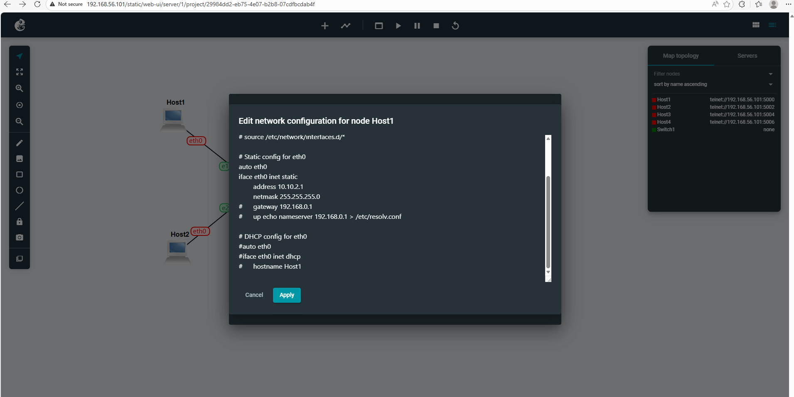
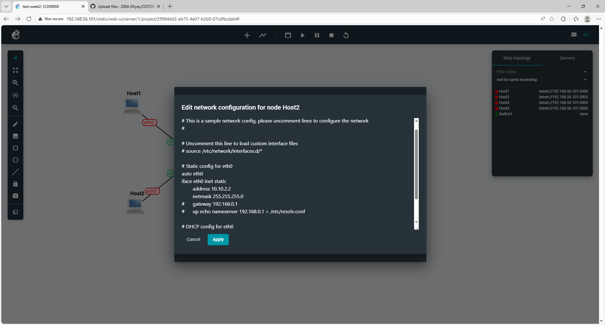
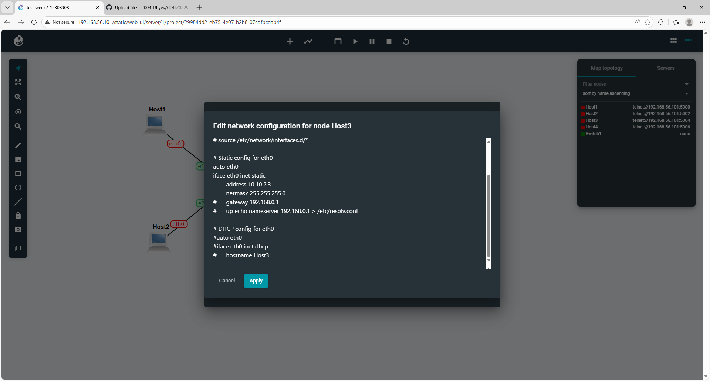
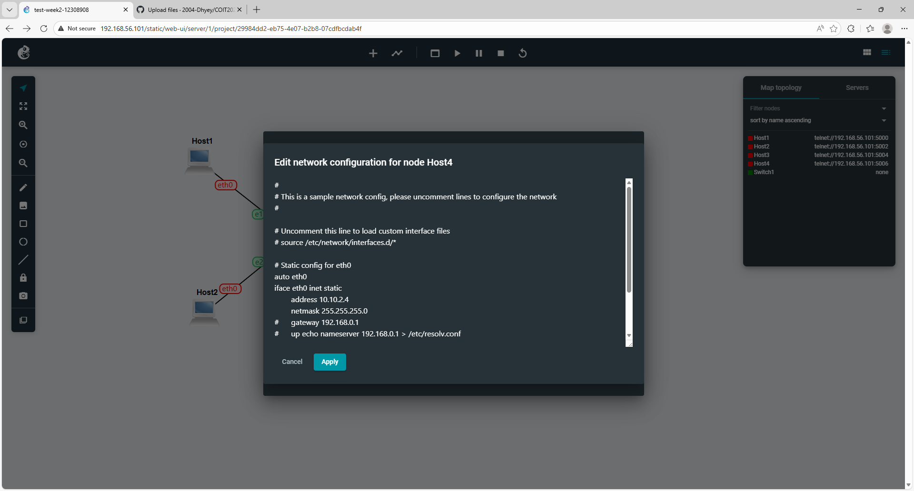

# COIT20261 – Portfolio
## Week 02 – IP Configuration and Ping Testing

**Name:** DHYEY VYAS  
**Student ID:** 12308908  
**Unit Code:** COIT20261  
**Term:** 2026 Term 1  
**Week:** 02  

---

## 1. Objective

The objective of this tutorial was to learn different methods of configuring static IP addresses on Linux hosts and to test network connectivity and delay using the ping command.

---

## 2. Project Setup

A GNS3 project was created with the name:

Setting-IP-StudentID

Example:
Setting-IP-12345678

The following devices were added:

- 4 × Linux Hosts
- 1 × Ethernet Switch

All hosts were connected to the switch to form a LAN network.

The IP network used:

10.1.1.0/24

---

## 3. IP Address Configuration

Each host was configured using a different method:

- Host A → GNS3 Configure
- Host B → GNS3 Configure
- Host C → /etc/network/interfaces
- Host D → ip command

---

### 3.1 GNS3 Configure Method

Used for Host A and Host B.

Static IP addresses were assigned before starting the nodes.

Example:

10.1.1.1  
10.1.1.2  

---

### 3.2 Using /etc/network/interfaces

On Host C, the following file was edited:

/etc/network/interfaces

Configuration used:

auto eth0  
iface eth0 inet static  
address 10.1.1.3  
netmask 255.255.255.0  

After editing, the network was restarted using:

ifdown eth0  
ifup eth0  

---

### 3.3 Using ip Command

On Host D, the IP address was assigned using:

ip address add 10.1.1.4/24 dev eth0  

This method applies changes immediately but is not permanent after reboot.

---

## 4. Verifying IP Addresses

The following command was used on all hosts:

ip address show  

This confirmed that each host had the correct IP address assigned.

### Screenshots

  
  
  
  

---

## 5. Network Topology

The network consists of four hosts connected to a switch.

---

## 6. Ping Testing

Ping was used to test connectivity and measure delay (Round Trip Time – RTT).

---

### 6.1 Basic Ping Test

Command used:

ping 10.1.1.2  

Ping was run from Host A to Host B and stopped after a few responses using Ctrl + C.

---

### 6.2 Ping to Invalid IP

Command used:

ping 10.1.1.99  

Since no device exists at this IP, the result showed packet loss.

---

### 6.3 Ping with Options

Command used:

ping -c 5 -i 2 -s 100 10.1.1.2  

Options used:

- -c 5 → limit to 5 packets  
- -i 2 → 2 second interval  
- -s 100 → packet size 100 bytes  

---

## 7. Files Included

- Week02-Portfolio.md  
- Setting-IP-StudentID.gns3project  
- images/Setting-IP-StudentID-network.png  
- images/Setting-IP-StudentID-host1.png  
- images/Setting-IP-StudentID-host2.png  
- images/Setting-IP-StudentID-host3.png  
- images/Setting-IP-StudentID-host4.png  
- images/Ping-Basics-StudentID-simple.png  
- images/Ping-Basics-StudentID-error.png  
- images/Ping-Basics-StudentID-options.png  

---

## 8. What I Learned

- Different methods to configure static IP addresses in Linux  
- Difference between temporary and permanent IP configuration  
- How to verify IP addresses using commands  
- How to use ping to test connectivity  
- How to measure delay and packet loss  

---

## 9. Conclusion

This tutorial provided practical knowledge on configuring IP addresses and testing network connectivity. It improved understanding of Linux networking and basic troubleshooting techniques using ping.
