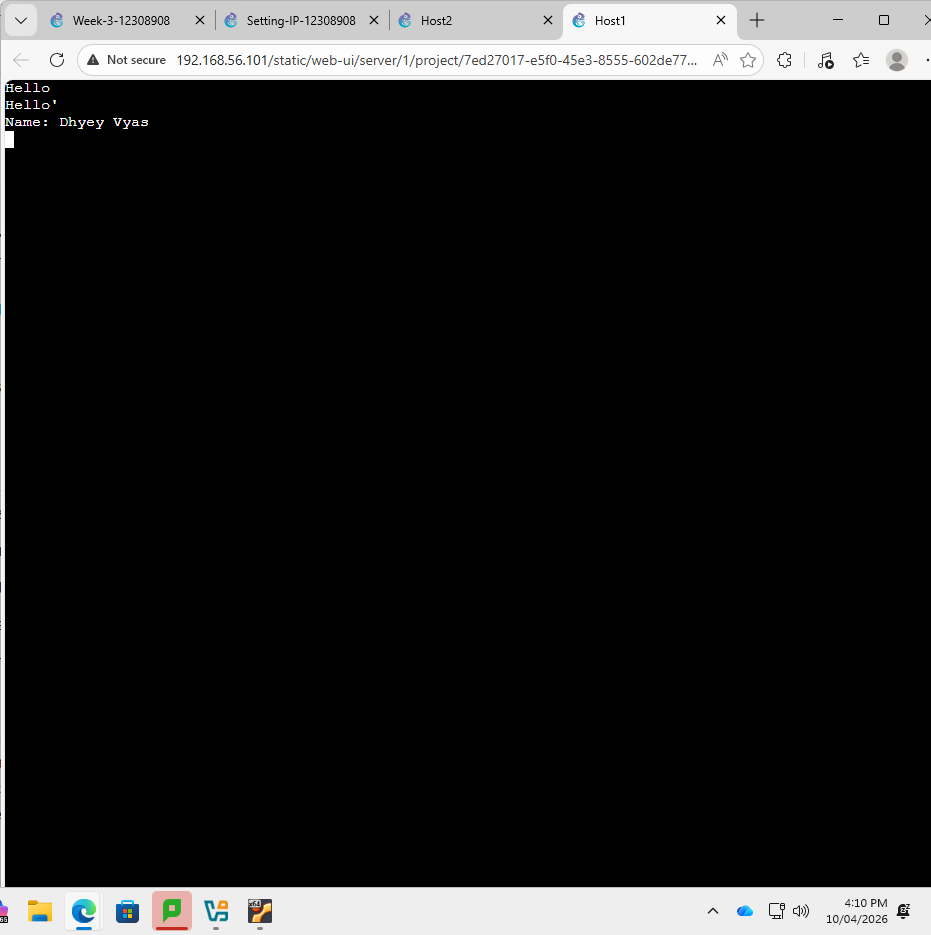

# COIT20261 – Portfolio
## Week 03 – Netcat Communication and Packet Capture

**Name:** Dhyey Vyas  
**Student ID:** 12308908  
**Unit Code:** COIT20261  
**Term:** 2026 Term 1  
**Week:** 03  

---

## 1. Objective

The objective of this tutorial was to learn simple application communication using Netcat and understand how to capture packets in a network using GNS3.

---

## 2. Project Setup

The existing project **Setting-IP-12308908** was used.

The network consisted of:

- 4 × Linux Hosts
- 1 × Ethernet Switch

---

## 3. Task 1 — Netcat Communication

### 3.1 Start Netcat Server

On Host A:

---

### 3.2 Starting Netcat Client

On Host B:

---

### 3.3 Sending Messages

Client sent:

Server replied:

Communication between hosts was successful.

---

### Screenshot

---

## 4. Task 2 — Packet Capture

### Start Capture

Packet capture was started on link between Host A and Switch.

File name used:

---

### Ping Test

---

### Netcat Test

Netcat was used to send message from Host A to Host C.

---

### Transfer Capture File

Directory:

---

## 5. Files Included

- Week03-Portfolio.md  
- Netcat-Basics-12308908-client-server.png  
- Capture-Basics-12308908-ping-netcat.pcap  

---

## 6. What I Learned

- Netcat client and server communication  
- Packet capture in GNS3  
- Difference between ping and netcat  
- Network troubleshooting basics  

---

## 7. Conclusion

This tutorial helped in understanding simple application communication and packet capture. It improved knowledge of network testing and troubleshooting.
