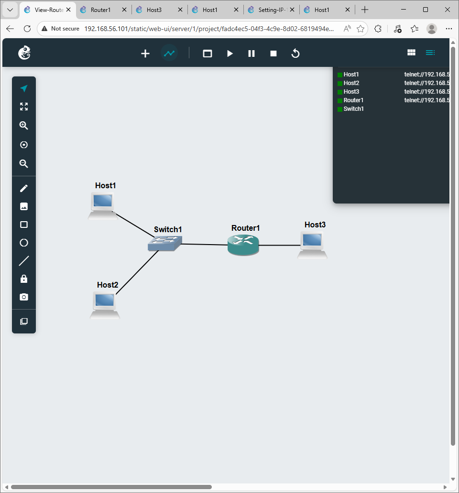
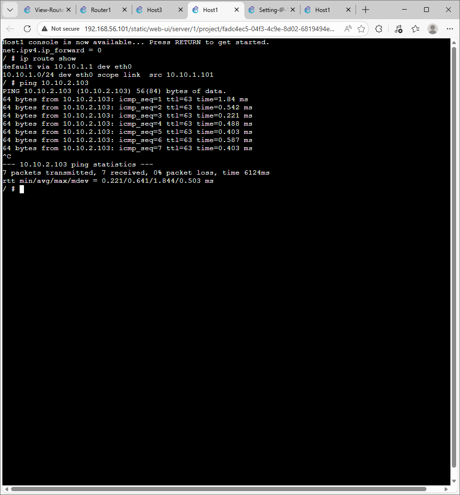

# COIT20261 – Portfolio
## Week 04 – Routing Tables and Dynamic Routing (OSPF)

**Name:** Dhyey Vyas  
**Student ID:** 12308908  
**Unit Code:** COIT20261  
**Term:** 2026 Term 1  
**Week:** 04  

---

## 1. Objective

The objective of this tutorial was to learn how to view routing tables, configure forwarding, and observe dynamic routing using OSPF.

---

## 2. Task 1 — View Routing Tables

### Project Setup

Project Name:

View-Routes-12308908

Devices Used:

- 3 × Linux Hosts  
- 1 × Linux Router  
- 1 × Ethernet Switch  

Two subnets were created.

Example:

Subnet 1:

10.1.1.0/24

Subnet 2:

10.1.2.0/24

---

## 3. IP Address Configuration

Example configuration:

Host A  
10.1.1.1  

Host B  
10.1.1.2  

Router Interface 1  
10.1.1.254  

Router Interface 2  
10.1.2.254  

Host C  
10.1.2.1  

---

## 4. Enable Forwarding

Router:

Hosts:

---

## 5. Viewing Routing Tables

---

## 6. Ping Testing

Ping confirmed successful routing between subnets.

---

### Screenshots

---

## 7. Task 2 — Dynamic Routing with OSPF

Imported Template:

OSPF-Basics-Template.gns3project

Routers Used:

- FRR1  
- FRR2  
- FRR3  
- FRR4  

---

## 8. Commands Used

---

## 9. Traceroute

Path between hosts observed.

---

## 10. Link Failure Test

One NETem node was stopped and traceroute was repeated.  
A new path was automatically selected by OSPF.

---

## 11. Files Included

- Week04-Portfolio.md  
- View-Routes-12308908-network.png  
- View-Routes-12308908-ping.png  
- OSPF screenshots  

---

## 12. What I Learned

- Routing tables  
- Router forwarding  
- OSPF dynamic routing  
- Traceroute usage  
- Network redundancy  

---

## 13. Conclusion

This tutorial provided understanding of routing tables and dynamic routing. It demonstrated how OSPF automatically adjusts paths during network changes.
