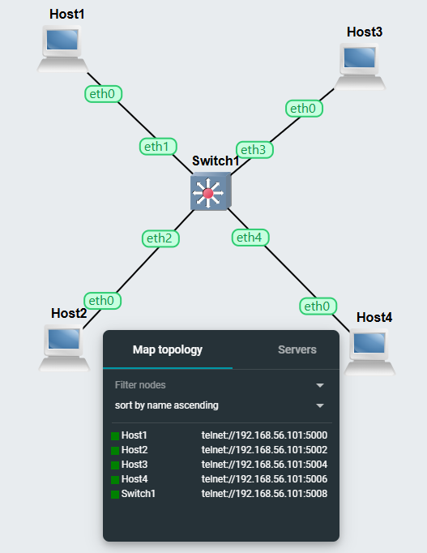

# COIT20261 – Portfolio
## Week 05 – VLAN Configuration

**Name:** Dhyey Vyas  
**Student ID:** 12308908  
**Unit Code:** COIT20261  
**Term:** 2026 Term 1  
**Week:** 05  

---

## 1. Objective

The objective of this tutorial was to learn VLAN configuration on switches and routers.

---

## 2. Task 1 — VLAN Basics

Project Name:

Vlan-Basics-12308908

Devices Used:

- 4 × Linux Hosts  
- 1 × OpenvSwitch  

All hosts were connected directly to switch.

All hosts were configured in same subnet.

Connectivity between hosts was tested successfully.

---

## 3. VLAN Configuration

Example:

Two VLANs created:

- VLAN 10
- VLAN 20

Connectivity between VLANs was isolated.

---

### Screenshot

---

## 4. Task 2 — VLAN Router

Project Name:

Vlan-Router-12308908

Linux Router added and connected to switch.

---

## 5. Configure Trunk Port

---

## 6. Router VLAN Interfaces

Create VLAN interface:

Assign IP:

Repeat for VLAN 20.

---

## 7. Connectivity Testing

Ping tested between hosts across VLANs.

All hosts successfully communicated through router.

---

## 8. Files Included

- Week05-Portfolio.md  
- Vlan-Basics-12308908-network.png  
- Vlan-Router-12308908-network.png  
- Vlan-Router-12308908-ports.png  

---

## 9. What I Learned

- VLAN basics  
- Access ports  
- Trunk ports  
- Router VLAN configuration  
- Inter-VLAN routing  

---

## 10. Conclusion

This tutorial improved understanding of VLAN configuration and routing between VLANs using router and switch.
