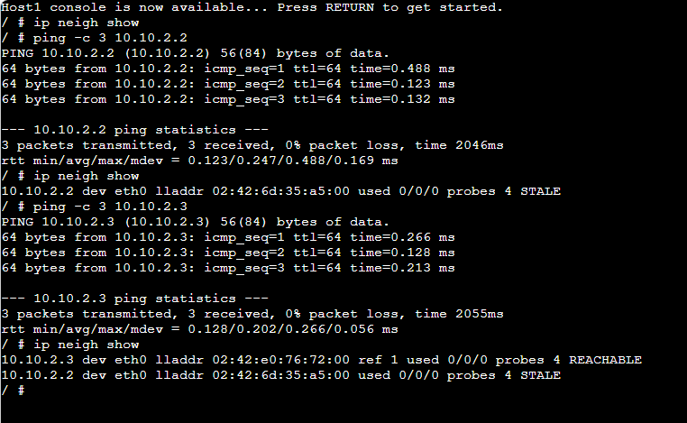
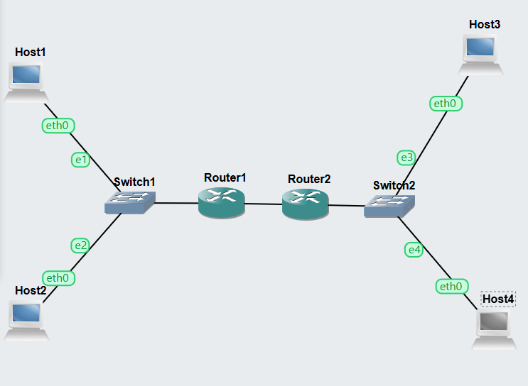
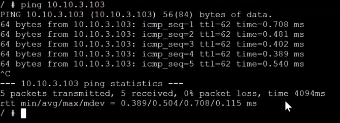

# COIT20261 – Portfolio
## Week 06 – ARP and Default Gateway

**Name:** Dhyey Vyas  
**Student ID:** 12308908  
**Unit Code:** COIT20261  
**Term:** 2026 Term 1  
**Week:** 06  

---

# Task 1 — Resolving IP Addresses to Hardware Addresses

## 1. Objective

The objective of this task was to understand how ARP (Address Resolution Protocol) maps IP addresses to hardware addresses within a Local Area Network (LAN).

---

## 2. Project Setup

The existing project **Setting-IP-12308908** was used.

The network contained:

- 4 Linux Hosts (Host A, Host B, Host C, Host D)
- 1 Ethernet Switch

All hosts were configured with static IP addresses.

---

## 3. Viewing ARP Table

The ARP table of Host A was viewed using:

Initially, the ARP table was mostly empty because no communication had occurred yet.

---

## 4. Ping Host A to Host B

Ping command executed from Host A to Host B:

This created ARP entries in Host A.

---

## 5. View ARP Table Again

After ping, the ARP table was viewed again:

The ARP table showed:

- IP Address of Host B
- Hardware Address (MAC Address)
- State (REACHABLE)

This confirmed that Host A learned the hardware address of Host B.

---

## 6. Ping Host C to Host A

Ping executed from Host C to Host A:

---

## 7. View ARP Table Again

The ARP table of Host A was viewed again:

Now additional entries appeared:

- Host C IP address
- Host C MAC address
- Connection state

This demonstrated how ARP dynamically updates.

---

## 8. Screenshots

Screenshots included:

- ARP-Basics-12308908-HostA-Table1.png

These screenshots illustrate ARP table changes.

---

## 9. What I Learned

- ARP maps IP addresses to MAC addresses  
- ARP entries are created dynamically  
- ARP entries expire over time  
- Communication updates ARP tables  

---

# Task 2 — Default Gateways

## 1. Objective

The objective of this task was to configure default gateways and enable routing between multiple subnets.

---

## 2. Project Creation

Project Name:

Default-Gateway-12308908

---

## 3. Network Topology

Network contained:

- 4 Linux Hosts  
- 2 Linux Routers  
- 2 Ethernet Switches  

Three Subnets:

- Subnet 1 — Host A and Host B  
- Subnet 2 — Host C and Host D  
- Subnet 3 — Router to Router connection  

---

## 4. IP Configuration

Each device configured using:

Example Host Configuration:

Router Configuration Example:

---

## 5. Start All Nodes

All devices were started in GNS3.

---

## 6. View Routing Tables

Routing table viewed using:

Routing tables confirmed default gateways.

---

## 7. Testing Network

Ping executed from Host A to Host D:

Ping was successful, confirming routing worked correctly.

---

## 8. Screenshots

Files included:

- Default-Gateway-network

- Default-Gateway-12308908-ping.png  
 

---

## 9. Files Submitted

- Default-Gateway-12308908.gns3project  
- Default-Gateway-12308908-network.png  
- Default-Gateway-12308908-ping.png  
- Week06-Portfolio.md  

---

## 10. What I Learned

- Default gateways enable routing  
- Multiple subnet communication  
- Router forwarding configuration  
- Static routing basics  

---

## 11. Conclusion

This tutorial demonstrated how ARP works and how default gateways enable communication between multiple subnets. This improved understanding of routing and network configuration.
